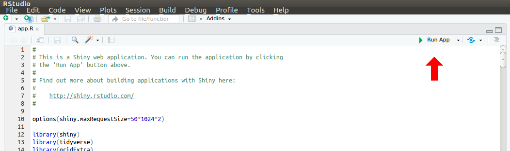

# MEx-IPA

M(alt)Ex(tract)-I(nteractive)P(lotting)A(pp)

Interactive viewer of MALT-Extract results. Interactive implementation of the post-processing visualiation scripts of the AMPs pipeline, that MALT-Extract is apart of.

Currently allows you to see damage patterns, edit distance and a read length distribution for each taxa in your MALT-Extract results. The benefit of this tool is that you can quickly scroll through your taxa and samples, as well as looking more closely at the results from specific filters - rather than opening lots of PDF files.

## Preparation
This shiny app requires the R packages shiny, tidyverse, and gridExtra.

To install these packages in R:

```R
install.packages(c("shiny", "tidyverse", "gridExtra"))
```

Prior to running the app, you must generate your input file. This is in the form of a zipped MALT-Extract results directory from AMPs v0.1. 

**Note**: that you need to zip from the parent directory of your MALT-Extract results, _do not_ give the full path.

```bash
zip -r <zip_archive_name>.zip <malt_extract_results_directory/
```

The default file size that can be used in the tool is 50MB. If your zip archive is larger than this, you can increased the maximum file size by modifying the 'options' on line 10 of the `app.R` file.

## Running

To run, either:

1) Load the app in Rstudio and press 'Run' in the top right of the code pane



OR

2) run the following from your terminal:

```
R -e "shiny::runApp('/<path>/<to>/MEx-IPA')"
```

and then go to the IP address given once loaded in your internet browser.
