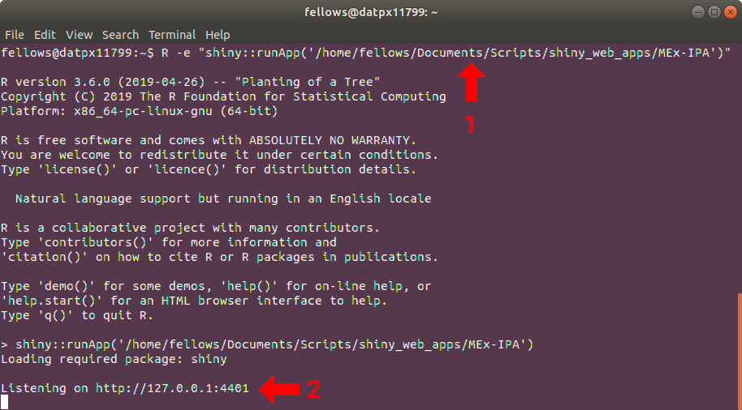
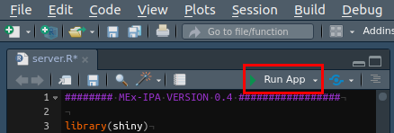

# MEx-IPA

**M**(alt)**Ex**(tract)-**I**(nteractive)**P**(lotting)A(pp)

Interactive viewer of MaltExtract results. Written by James A. Fellows Yates.

## Table of Contents  
 * [Description](#description)  
 * [Installation](#installation)
 * [Running](#running)
 * [FAQs](#faqs)
 * [References](#references)
 * [Change Log](#change-log)

## Description
[MaltExtract](https://github.com/rhuebler/MaltExtract) is a part of the [HOPS pipeline](https://github.com/rhuebler/HOPS) ([Huebler et al. 2019 bioRxiv](https://doi.org/10.1101/534198)).
It extracts various metrics of from alignments as stored
in MEGAN6 ([Huson et al. 2016 PloS Comp. Bio.](https://doi.org/10.1371/journal.pcbi.1004957)) RMA6 files.
It is particularly designed for identifiying authentic ancient DNA of 
a given organism.

This R shiny app is a modified implementation of the metric visualisation 
script of the HOPS pipeline, with additional interactive plot functionality.

It will display the following distributions of the alignments of a given sample
and taxonomic node:
  * General statistics table of the node (e.g. mean alignents to a node)
  * C to T miscorporation(a.k.a damage plots)
  * Read length
  * Edit distance
  * Percent identity
  * Percentage of reference covered (breadth coverage)
  * Fold coverage (depth coverage)

It also provides two comparison panes - for a given characteristic, a) for a
given node, the plots for every sample with data on that node, and b) for a 
given sample, plots for every node. This allows for fast detection of potential
samples or taxa of interest from large datasets.  


**Demo of MEx-IPA Functionality**

## Installation

To download the app, change to a directory where you wish to install the 
app, and run the following in your terminal

```bash
git clone https://github.com/jfy133/MEx-IPA.git
```

This will download all the app files from this github repository to a
directory named MEX-IPA.

This shiny app has been tested on `R` version 3.6.1, and requires the following 
packages:

 * shinyWidgets (tested v0.4.8)
 * shinycustomloader (tested v0.9.0)
 * patchwork (tested v0.0.1)
 * DT (tested v0.7)
 * plotly (tested v4.9.0)
 * data.table (tested v1.12.2)
 * tidyverse (tested v1.2.1)
 * shiny (tested v1.3.2)

To install the app's dependecies, you have two methods

<details><summary>1) Try with your current R and associated package versions (but this may not work)
</summary>

Load your local version of R in your terminal

Install versions of packages associated with your version of R:

```r
install.packages(c("shiny", "tidyverse", "data.table", "plotly", "DT", 
  "patchwork", "shinycustomloader", "shinyWidgets"))
```

</details>

or


<details><summary>2) Use conda to install the specific R version and packages listed above</summary>
Changed into the cloned MEx-IPA Directory

```bash
cd MEx-IPA
```

Create a conda environment, and follow instructions as displayed in your 
terminal.

```bash
conda env create -f environment.yaml
```

Activate the newly created environment

```bash
conda activate MEx-IPA
```

Check you've loaded the correct version of R (it should say 3.6.1)

```bash
which R
```

Now load R 

```bash
R
```

Now we need to make sure you install the missing MEx-IPA to the conda 
environment's Rlibs path and not computers default ones. This is an issue with 
the R versions in conda and will be fixed soon.

```r
.libPaths(.libPaths()[grep("envs/MEx-IPA/lib/R/library", .libPaths())])
```

Now we can install the packages not in the conda channels.

```r
devtools::install_github("thomasp85/patchwork")
install.packages("shinycustomloader")
```

Once installed, you can exit R, pressing `n` when it asks to save your 
workspace.

```r
quit()
```

To finish, deactivate the conda environment with

```bash
conda deactivate
```
</details>

## Running

Once installed there are two methods of running the app. 

1) Run the following command from your terminal (if you want to use your conda
environment make sure to activate your conda environment first)

```bash
R -e "shiny::runApp('/<path>/<to>/MEx-IPA')"
```



and then go to the IP address given once loaded in your internet browser.

2) Alternatively, you can use Rstudio to load either the `server.R` or `ui.R` 
file, and press the 'Run App' button in the top right hand corner of the 
code pane.



> NB: For both methods, you must run on the app on an a machine that is able to 
> access your MaltExtract results directory via a directory path e.g. as listed 
> in from your file explorer. It does not take remote URLs.

3) Type or copy and paste the path to your MaltExtract results directory. Once
the RunSummary.txt file is found in this directory, the 'Run Visualisation' 
button will appear. You can try this with some test data from Weyrich et al. 
(2017) and Velsko et al. (2019) in this repository under 
`dev/test_data/maltExtract_v1.5_Weyrich2017Velsko2019/` 

4) Customise the display based on the options on the left. Remove from
file name allows you to remove a given string (e.g. file suffix) from the
sample names. Interactive plots allow you to hover over lines or bars to get
specific alignment counts for that position or bin.

> NB: If you have a very large MaltExtract results run, plots may take a 
> long time to display - particularly on the multi-plot panels.

5) You can download the summary stats table in a range of tabular formats 
using the 'Download Table' button above the table.

6) You can save a PDF report of the non-interactive single sample displays with 
the 'download PDF' report button. The PDF can be modified by loading into 
vector-based image software such as [inkscape](https://inkscape.org/). 

> NB: If loading into inkscape, load with 'internal import' so text is 'stored
> as text'. Text boxes can be made editable by selecting the box and going 
> Text > Remove Manual Kerns

7) Single interactive plots can be saved in png format via the camera button
of a given plot.

8) To finish: if running on your own machine - press 'Close app' to shut the 
viewer and stop the shiny app instance in R.

## FAQs

### I just see a white screen where the plots should be!

This can be because it takes a long time to render the plots - particularly
when you are displaying many plots at once or if loading the data
from a remote server into your own computer. Be patient.

### What is the difference between the 'everything at 0' plots and the 'No Input data found' messages

This is something to do with the way MaltExtract saves results. The both 
essentially mean the same thing: there are no alignments to that specific node.

### Why is the interactive plots a bit ugly with titles and axis labels?
The `plotly` package is unfortunately not fully compatible with all `ggplot` 
functions. I tried different ways of hacking around it but failed. However,
this does not remove from the utility of being able to get fine resolution
statistics of each characteristic.

### I don't get the same results as with the HOPS post-processing scripts!

This is likely related to small differences in the way data is summarised. I take a simpler approach and report the exact statistics a given node (e.g. just species), whereas HOPS' post-processing scripts additionally summarises all taxonomic levels under a given node (e.g. a species + related subspecies).

## References

Huebler, R. et al. HOPS: Automated detection and authentication of pathogen DNA in archaeological remains. bioRxiv 534198 (2019). doi:[10.1101/53419](http://dx.doi.org/10.1101/534198)

Huson, D. H. et al. MEGAN Community Edition - Interactive Exploration and Analysis of Large-Scale Microbiome Sequencing Data. PLoS Comput. Biol. 12, e1004957 (2016). doi:[10.1371/journal.pcbi.1004957](http://dx.doi.org/10.1371/journal.pcbi.1004957)

Velsko, I. M. et al. Microbial differences between dental plaque and historic dental calculus are related to oral biofilm maturation stage. Microbiome 7, 102 (2019). doi:[10.1186/s40168-019-0717-3](http://dx.doi.org/10.1186/s40168-019-0717-3)

Weyrich, L. S. et al. Neanderthal behaviour, diet, and disease inferred from ancient DNA in dental calculus. Nature 544, 357–361 (2017). doi:[10.1038/nature21674](http://dx.doi.org/10.1038/nature21674)

## Change Log
**0.4.3**
  * Added `shinytest` tests
  * Added 'close app' button - when running on own machine/Rstudio

**0.4.2**
  * Fixed missing data message for multi-sample comparison
  * Temporarily deactivated multiple-taxa comparison due to missing data resulting in empty divs
  * Added more documentation on github repo, and documentation panel to app itself

**0.4.1**
  * New-new rewrite with dynamically generate plots and an option for interactive plots

**0.4**
  * New rewrite with dynamically generate plots and an option for interactive plots

**<0.4** 
  * Experimental alpha versions
