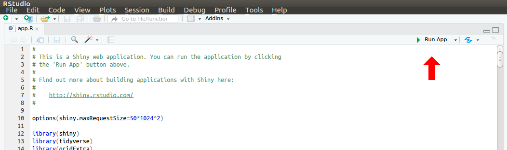

# MEx-IPA

M(alt)Ex(tract)-I(nteractive)P(lotting)A(pp)

Interactive viewer of MALT-Extract results. 

MaltExtract is a part of the HOPS pipeline ([Huebler et al. 2019 bioRxiv](https://doi.org/10.1101/534198)).
It extracts various metrics of interest for palaeogenetics from alignments as recorded
in MEGAN6 ([Huson et al. 2016 PloS Comp. Bio.](https://doi.org/10.1371/journal.pcbi.1004957)) RMA6 files.

This R shiny app is a modified implementation of the metric visualisation 
script of the HOPS pipeline, with additional interactive functionality.

It will display the following distributions of the alignments of a given sample
and taxonomic node:
  * C to T miscorporation (a.k.a damage plots)
  * Read length
  * Edit distance
  * Percent identity
  * Percentage of reference covered
  * Fold coverage

And a table of general node statistics.

## Preparation
This shiny app has been tested on `R` version 3.6, and requires the packages 
`shiny` (tested v1.3.2), `tidyverse` (tested 1.2.1), `data.table` (tested 1.12.2) 
and `plotly` (tested v4.9.0).

To install these packages in R:

```r
install.packages(c("shiny", "tidyverse", "shiny", "plotly))
```

## Running

To run, either:

1a) Load the app in Rstudio and press 'Run' in the top right of the code pane



OR

1b) run the following from your terminal:

```bash
R -e "shiny::runApp('/<path>/<to>/MEx-IPA')"
```

and then go to the IP address given once loaded in your internet browser.

> The shiny app must be run a computer or server that has access to your 
maltExtract output directories (e.g. ran directly from the server, or 
on your personal computer that has the server folders mounted to your 
file browser)

2) Type or copy and paste the path to your maltExtract results directory. Once
the RunSummary.txt file is found in this directory, the 'Run Visualisation' button
will appear.

3) To save a particular plot, look for the camera icon on the plotly toolbar. 

## References

Huebler, R. et al. HOPS: Automated detection and authentication of pathogen DNA in archaeological remains. bioRxiv 534198 (2019). doi:10.1101/53419

Huson, D. H. et al. MEGAN Community Edition - Interactive Exploration and Analysis of Large-Scale Microbiome Sequencing Data. PLoS Comput. Biol. 12, e1004957 (2016).
